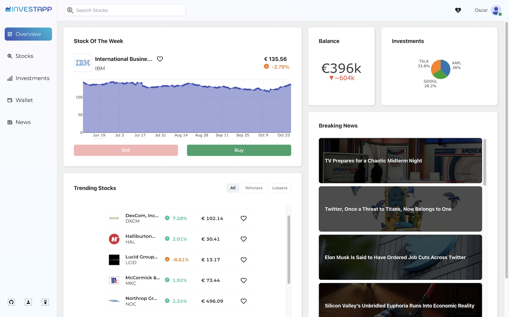

<a name="readme-top"></a>

<br />
<br />

  <a href="https://investapp.oscargonzalez.dev">
    
  </a>

  <p align="center">
    Investment Dashboard
    <br />
    <a href="https://investapp.oscargonzalez.dev">View Demo</a>
    ·
    <a href="https://github.com/oscargonzalezdev/investment-dashboard-client/issues/new">Report Bug</a>
    ·
    <a href="https://www.buymeacoffee.com/oscardev">Support</a>
  </p>
</div>

<br/>
<!-- TABLE OF CONTENTS -->
<details>
  <summary>Table of Contents</summary>
  <ol>
    <li>
      <a href="#about-the-project">About The Project</a>
      <ul>
        <li><a href="#built-with">Built With</a></li>
      </ul>
    </li>
    <li>
      <a href="#getting-started">Getting Started</a>
      <ul>
        <li><a href="#installation">Installation</a></li>
      </ul>
    </li>
    <li><a href="#usage">Usage</a></li>
    <li><a href="#roadmap">Roadmap</a></li>
    <li><a href="#contributing">Contributing</a></li>
    <li><a href="#license">License</a></li>
    <li><a href="#contact">Contact</a></li>
    <li><a href="#links">Links</a></li>
  </ol>
</details>

<br/>

<!-- ABOUT THE PROJECT -->
## About The Project

[](https://investapp.oscargonzalez.dev)

Investapp is a client-side web application that allows users simulate trading stocks with a starting balance.

### Built With

* <strong>React</strong> for UI building.
* <strong>Plotly.js</strong> for data visualization.
* <strong>Chackra UI</strong> for UI styling.
* <strong>JavaScript, HTML, CSS</strong> as a general stack to build web applications.


<!-- GETTING STARTED -->
## Getting Started

To get and run a local copy of this project follow the instructions below.

### Installation

1. Clone the repo
   ```sh
   git clone https://github.com/oscargonzalezdev/investment-dashboard-client.git
   ```
2. Install NPM packages
   ```sh
   npm install
   ```
3. Run the project locally
   ```sh
   npm start
   ```
